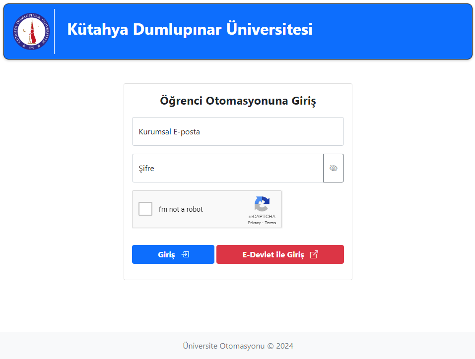
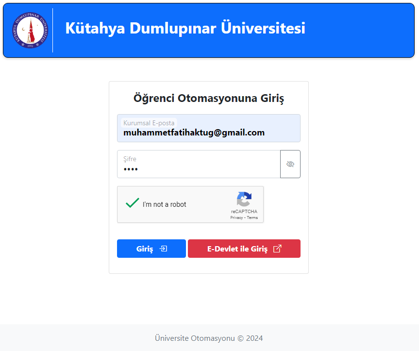
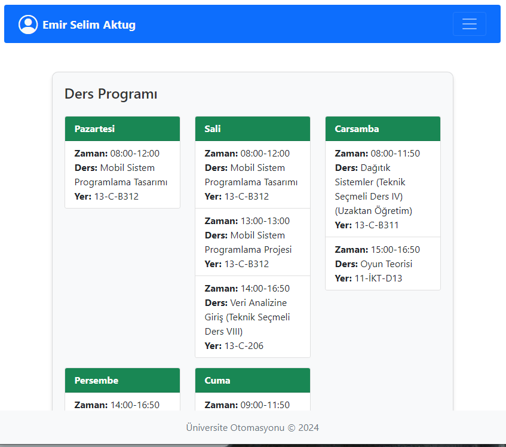
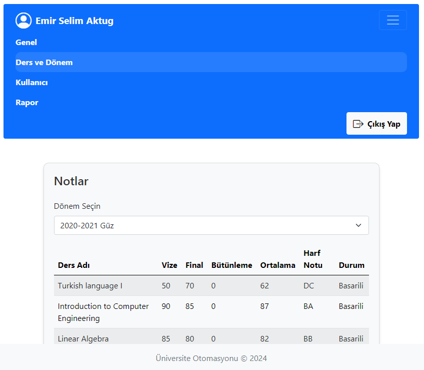
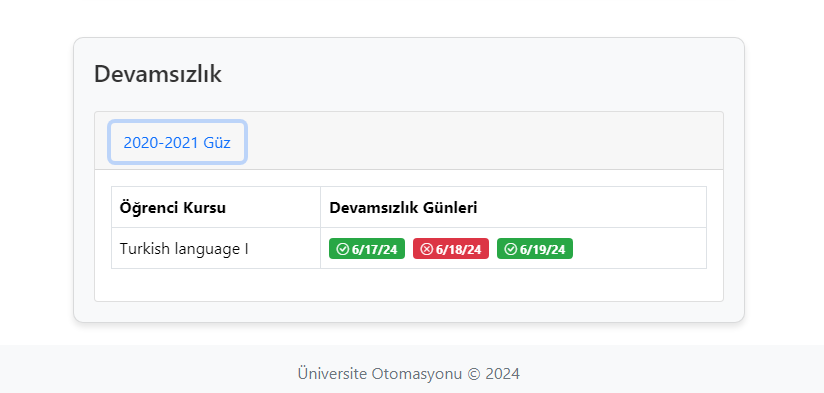
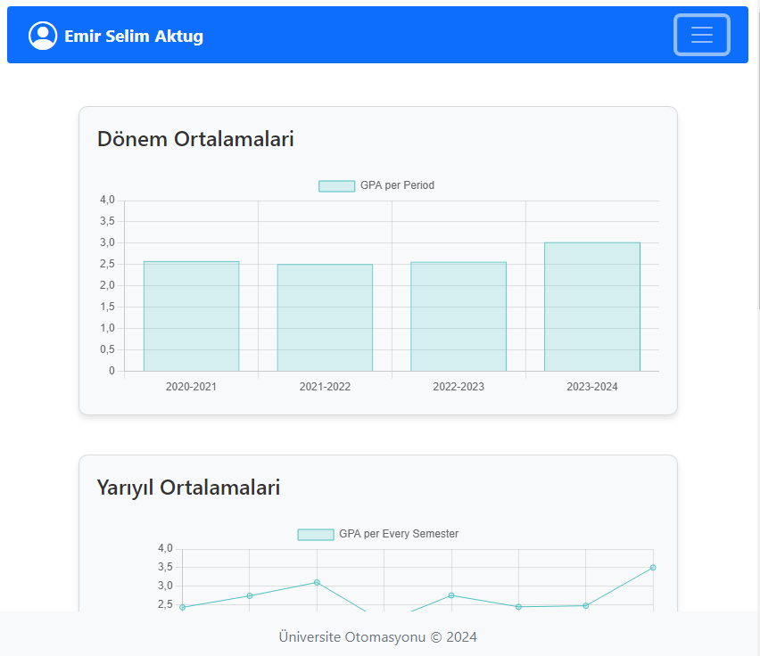
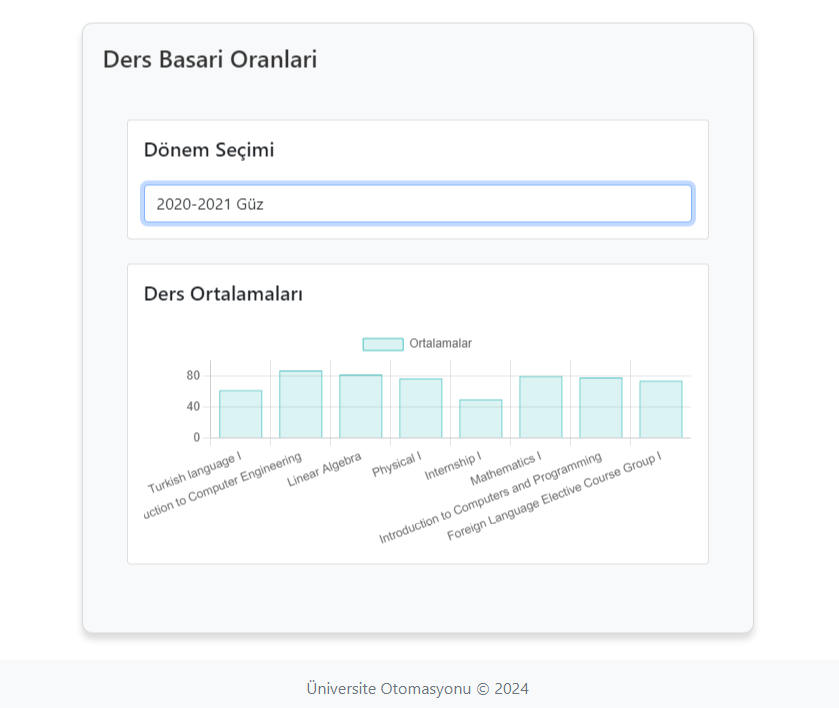
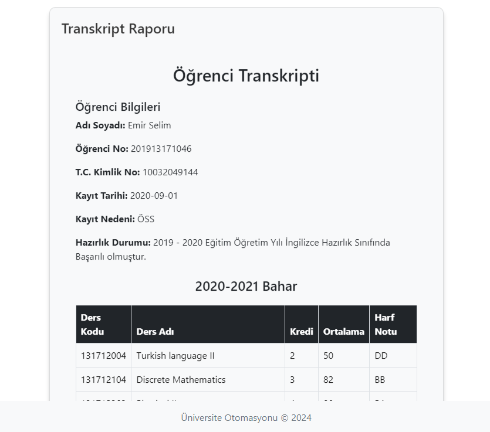

# CollageAutomationSystemsFrontend

This project was generated with [Angular CLI](https://github.com/angular/angular-cli) version 17.3.5.

## Description

CollageAutomationSystemsFrontend is a web application built using Angular, incorporating Chart.js for data visualization and Bootstrap 5 for styling and responsive design. This project was developed as an example of a university automation system with the goals of enhancing user efficiency, security, and performance. It includes features such as user authentication, dynamic data representation, and responsive UI components.

## Development server

Run `ng serve` for a dev server. Navigate to `http://localhost:4200/`. The application will automatically reload if you change any of the source files.

## Code scaffolding

Run `ng generate component component-name` to generate a new component. You can also use `ng generate directive|pipe|service|class|guard|interface|enum|module`.

## Build

Run `ng build` to build the project. The build artifacts will be stored in the `dist/` directory.

## Running unit tests

Run `ng test` to execute the unit tests via [Karma](https://karma-runner.github.io).

## Running end-to-end tests

Run `ng e2e` to execute the end-to-end tests via a platform of your choice. To use this command, you need to first add a package that implements end-to-end testing capabilities.

## Technologies Used

- **Angular**: A platform for building mobile and desktop web applications. Angular was chosen for its powerful features, including a robust component-based architecture and excellent tooling.
- **Chart.js**: A JavaScript library for data visualization. Chart.js was used to create interactive and visually appealing charts and graphs within the application.
- **Bootstrap 5**: A framework for building responsive, mobile-first websites. Bootstrap 5 was utilized to ensure the application has a modern and consistent look and feel, as well as to make it responsive across different devices.

## How to Use

### Prerequisites

Before you begin, make sure you have the following installed on your machine:

- Node.js
- Angular CLI

### Installation

1. Clone the repository:
    ```bash
    git clone https://github.com/kullaniciadi/CollageAutomationSystemsFrontend.git
    cd CollageAutomationSystemsFrontend
    ```

2. Install the dependencies:
    ```bash
    npm install
    ```

3. Start the development server:
    ```bash
    ng serve
    ```

4. Open your browser and navigate to `http://localhost:4200/`.

## Screenshots

Here are some screenshots of the application:

### Login Page



### Filled Login Page



### Main Page



### Navbar



### Absenteeism Page



### Statistics Page




### Transcript Page



## Further help

To get more help on the Angular CLI use `ng help` or go check out the [Angular CLI Overview and Command Reference](https://angular.io/cli) page.

## Contribution

Contributions are welcome! If you have suggestions or find issues, please open an issue or submit a pull request. Follow these steps to contribute:

1. Fork the repository (https://github.com/kullaniciadi/CollageAutomationSystemsFrontend/fork)
2. Create a new branch (`git checkout -b feature-name`)
3. Make your changes and commit them (`git commit -am 'Add new feature'`)
4. Push to the branch (`git push origin feature-name`)
5. Open a Pull Request

## License

Distributed under the MIT License. See `LICENSE` for more information.

